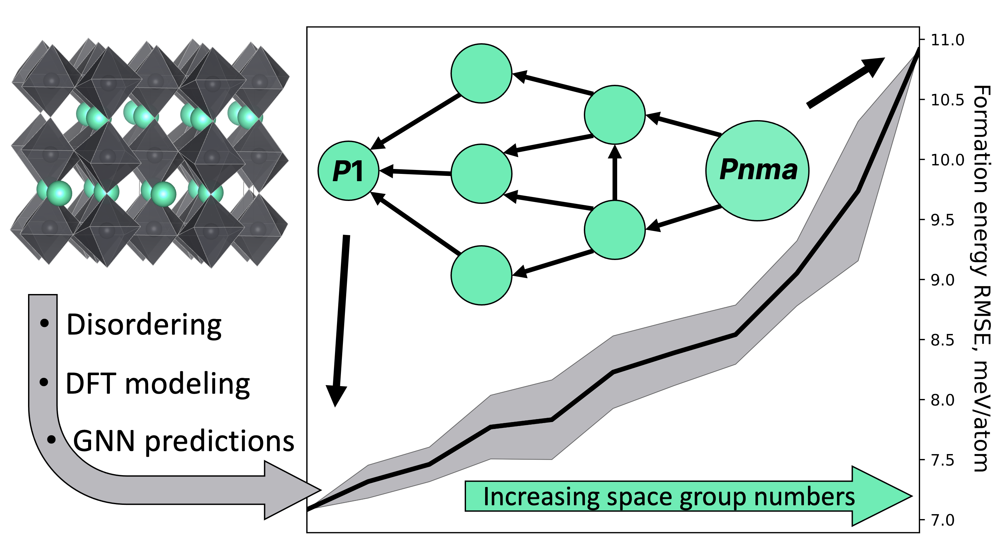

# Cd/Zn- and Br-doped CsPbI<sub>3</sub> Energetics: DFT-derived Properties and GNN-based Predictions

Lead halide perovskites are well-known family of functional materials for optoelectronic applications. The γ-phase of CsPbI<sub>3</sub> retains favorable optoelectronic characteristics, such as direct bandgap and high charge-carrier mobility. However, any large-scale applications of CsPbI<sub>3</sub> face difficulties caused by its polymorphic transitions into the undesirable δ-CsPbI<sub>3</sub> phase possessing no useful properties. One of many methods for stabilization of the γ-phase is partial substitution of Pb<sup>2+</sup> by Cd<sup>2+</sup>/Zn<sup>2+</sup> and I<sup>-</sup> by Br<sup>-</sup>. Such chemical modifications lead to a dramatic increase in the complexity of the corresponding compositional/configurational space (CCS) from computational/predictive perspectives. Due to the size of such space, the application of density functional theory (DFT) calculations for thermodynamic properties assessment  is accompanied by modern data-driven solutions, e.g. those based on graph neural network (GNN) architectures.
<!--More details can be found in the [paper](https://doi.org/10.1016/j.commatsci.2023.112672)-->.
<!--
If you are using this dataset in your research paper, please cite us as
```
@article{EREMIN2024112672,
title = {Graph neural networks for predicting structural stability of Cd- and Zn-doped γ-CsPbI3},
journal = {Computational Materials Science},
volume = {232},
pages = {112672},
year = {2024},
issn = {0927-0256},
doi = {https://doi.org/10.1016/j.commatsci.2023.112672},
url = {https://www.sciencedirect.com/science/article/pii/S0927025623006663},
author = {Roman A. Eremin and Innokentiy S. Humonen and Alexey A. Kazakov and Vladimir D. Lazarev and Anatoly P. Pushkarev and Semen A. Budennyy}}
```
-->


Dataset
-----
The dataset contains  Cd/Zn- and Br-doped CsPbI<sub>3</sub> systems in two polymorphic modifications and predictions of their formation energies made using GNN-model Allegro trained on the DFT derived properties.
For each combination of metal dopant (Cd and Zn) and material phase (black γ- and yellow δ-CsPbI<sub>3</sub>), listed in the table below, we created distinct CCS.


<div align="center">
  
| CsPbI<sub>3</sub> phase | Cd dopant                                  | Zn dopant                                  |
|-------------------------|--------------------------------------------|------------------------------------------------------------------------------------------------------------|
| Black                   | [CCS_black_Cd](data/CCS_black_Cd.pkl.gz)   | [CCS_black_Zn](data/CCS_black_Zn.pkl.gz)   |
| Yellow                  | [CCS_yellow_Cd](data/CCS_yellow_Cd.pkl.gz) | [CCS_yellow_Zn](data/CCS_yellow_Zn.pkl.gz) |
</div>
Thus, each presented pandas dataframe contains crystal structure in CIF format, metainformation columns, DFT-calculated energies, subsample indicators and GNN predictions. Dataframe columns "Formula", "Atomic_numbers", "Cell", "Pos", "Relaxed_*", "Formation_energy_pa" contain data for DFT-calculated structures only, namely, 545 and 1006 values for CCS_black_* and CCS_yellow_*, correspondingly. Missing values in mentioned columns are marked by NaN. More detailed description you can find in the table below.
<div align="center">

| Column tag                  | Content description                                                                                                   |
|-----------------------------|-----------------------------------------------------------------------------------------------------------------------|
| CIF_data                    | Data representing crystal structure in CIF format                                                                     |
| CIF_filename                | Structure name (unique within all dataframes)                                                                         |
| Phase                       | Black/yellow (corresponds to the phase studied)                                                                       |
| Dopant                      | Cd/Zn (dopant type in the structure)                                                                                  |
| Dopant_content              | Dopant content (in mol. %)                                                                                            |
| Br_content                  | Br content (in mol. %)                                                                                                |
| Space_group_no              | Space group number of the doped structure before relaxation                                                           |
| Space_group_symbol          | Space group symbol of the doped structure before relaxation (Hermann-Mauguin notation)                                |
| Weight                      | Corresponds to the number of symmetrically equivalent structures within combinatorial composition/configuration space |
| Pb_4b_position_substitution | Amount of substituted Pb atoms at Wyckoff site 4b in a supercell (relevant for black phase only)                      |
| I_4c_position_substitution  | Amount of substituted I atoms at Wyckoff site 4c in a supercell (relevant for black phase only)                       |
| I_8d_position_substitution  | Amount of substituted I atoms at Wyckoff site 8d in a supercell (relevant for black phase only)                       |
| Pb_4c_position_substitution | Amount of substituted Pb atoms at Wyckoff site 4c in a supercell (relevant for yellow phase only)                     |
| I1_4c_position_substitution | Amount of substituted I atoms at Wyckoff site 4c (type 1) in a supercell (relevant for yellow phase only)             |
| I2_4c_position_substitution | Amount of substituted I atoms at Wyckoff site 4c (type 2) in a supercell (relevant for yellow phase only)             |
| I3_4c_position_substitution | Amount of substituted I atoms at Wyckoff site 4c (type 3) in a supercell (relevant for yellow phase only)             |
| Formula                     | Chemical brutto formula of the structure in format {'chemical element symbol': its amount in a supercell}             |
| Atomic_numbers              | Atomic numbers of the chemical elements in the structure                                                              |
| Cell                        | Model basis vectors (in angstroms) before relaxation - constant feature for a certain phase                           |
| Pos                         | Atomic positions (in angstroms) before relaxation (sequence coincides with that of Atomic_numbers)                    |
| Relaxed_cell                | Model basis vectors (in angstroms) after DFT relaxation                                                               |
| Relaxed_pos                 | Atomic positions (in angstroms) after DFT relaxation (sequence coincides with that of Atomic_numbers)                 |
| Relaxed_pressure            | Pressure (in kbar) for the DFT-relaxed structure                                                                      |
| Relaxed_forces              | Atomic forces (in eV/angstrom) for the DFT-relaxed structure (sequence coincides with that of Atomic_numbers)         |
| Relaxed_energy              | Relaxed energy per cell (in eV) for the DFT-relaxed structure                                                         |
| Relaxed_energy_pa           | Relaxed energy per atom (in eV/atom) for the DFT-relaxed structure                                                    |
| Formation_energy_pa         | Formation energy per atom (in eV/atom) for the DFT-relaxed structure                                                  |
| PHS_train                   | Boolean flag showing whether the structure is in the PHS training subset                                              |
| PHS_val                     | Boolean flag showing whether the structure is in the PHS validation subset                                            |
| PHS_test                    | Boolean flag showing whether the structure is in the PHS test subset                                                  |
| PLS_train                   | Boolean flag showing whether the structure is in the PLS training subset                                              |
| PLS_val                     | Boolean flag showing whether the structure is in the PLS validation subset                                            |
| PLS_test                    | Boolean flag showing whether the structure is in the PLS test subset                                                  |
| PHS_model_fepa_prediction   | Structure formation energy per atom (in eV/atom) predicted by GNN-model trained on the PHS training subset            |
| PLS_model_fepa_prediction   | Structure formation energy per atom (in eV/atom) predicted by GNN-model trained on the PLS training subset            |
</div>

Scripts
-----
The repository also contains a [Jupyter Notebook](data_processing.py) file with utils and visualisation scripts. You can calculate and visualise energy distributions, RMSEs, predictions, etc.

Model
-----
[Learning Local Equivariant Representations for Large-Scale Atomistic Dynamics (Allegro)](https://arxiv.org/abs/2204.05249)
